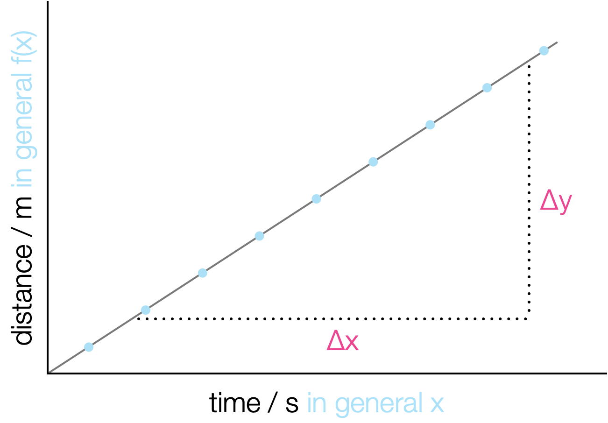
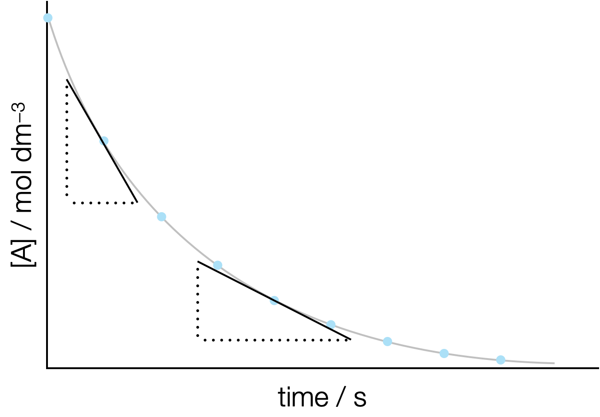
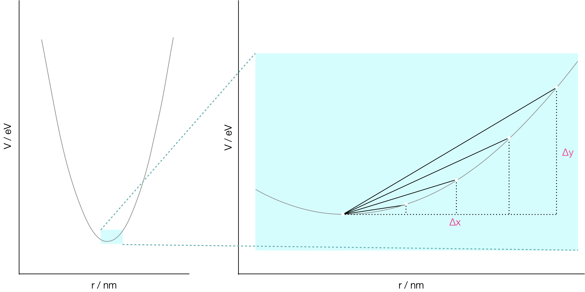
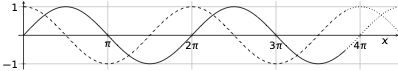
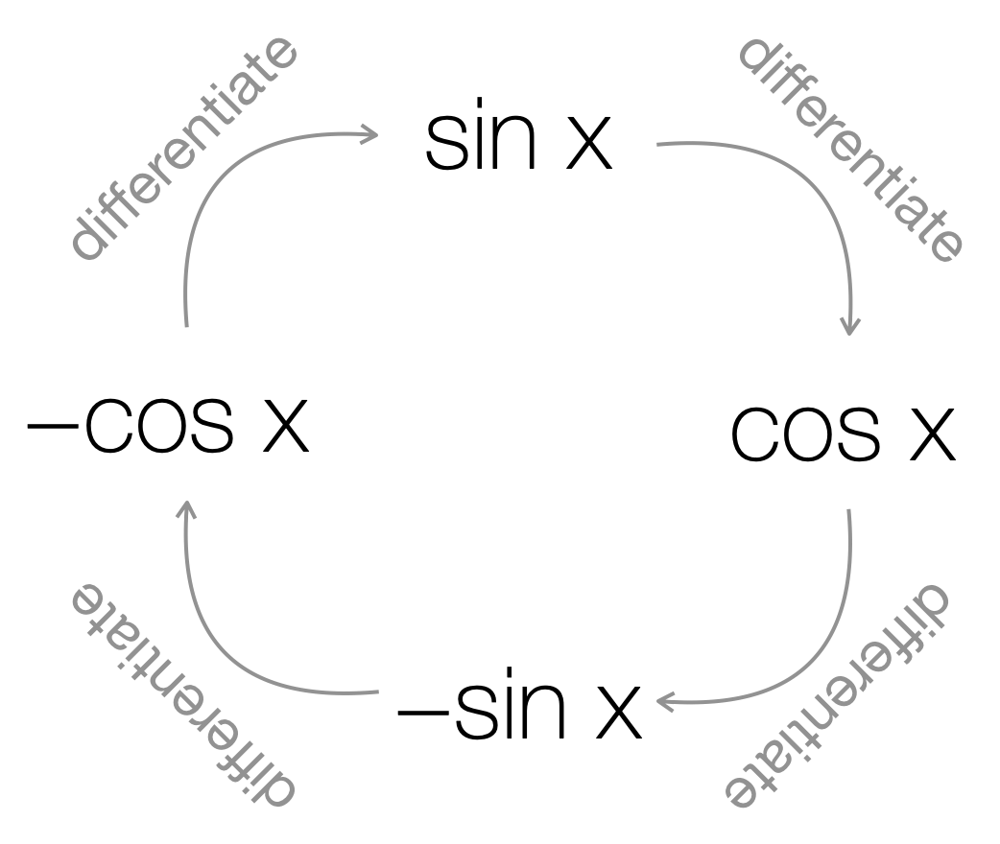
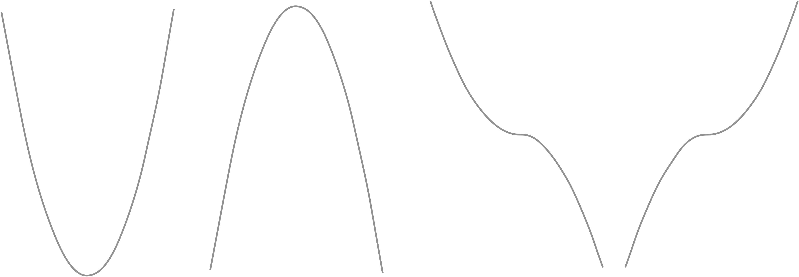
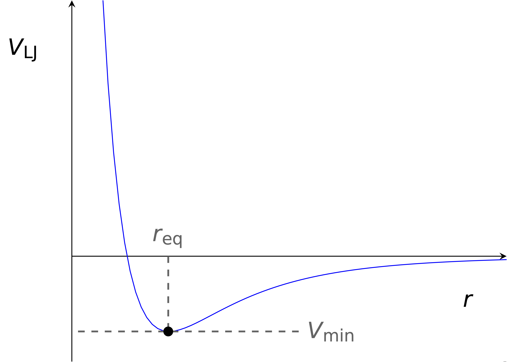

# Week 4 {#ch:Workshop4}

## Preliminary infomation {#sec:Prelim4}

Rates of change are important, whether it is the steepness of a hill (the rate of change of elevation with horizontal distance travelled), speed (rate of change of distance with time) or the rate of reaction (change in concentration of a reactant with respect to time). Differentiation is a mathematical method for determining the rate of change of one variable with another. 

Some functions are 'linear' (figure \@ref(fig:linear)), and the rate of change of the function is the gradient, $\frac{\Delta y}{\Delta x}$. So if we look at figure \@ref(fig:linear) the change of distance ($\Delta y$) with respect to time ($\Delta x$) is just the gradient, but not all functions are linear, and so not all gradients are constant, therefore not all rates of change are constant.

```{r echo=FALSE, linear, out.width='50%', fig.show='hold', fig.align='center', fig.cap='A linear plot with time on the x-axis and distance on the y axis, the gradient of the line is the velocity, the rate of change of distance with respect to time.'}

```

Many chemical reactions show a curved decay of concentration of reactant with time (figure \@ref(fig:expplot)). In this case the gradient of the line depends on where you measure it.

```{r echo=FALSE, expplot, out.width='50%', fig.show='hold', fig.align='center', fig.cap='An exponential decay plot with time on the x-axis and concentration of a reactant A on the y axis, the gradient is the rate of reaction and the rate of reaction varies with how far the reaction has proceeded.'}

```

Differentiation is a mathematical way of determining what this gradient is at any given point.

### What is differentiation {#subsec:whatisdiff}

If we look at figure \@ref(fig:linear) the line fits the equation $y = mx+c$. The gradient of that line, $m$, is given by the change in y divided by the change in x:

\begin{equation*}
m = \frac{\Delta y}{\Delta x} = \frac{y_2-y_1}{x_2-x_1}
\end{equation*}

For each of the two points used to determine the gradient we may write an equation defining that point:

\begin{equation*}
y_1 = mx_1 + c\\
y_2 = mx_2 + c
\end{equation*}

and $x_2 = x_1+\Delta x$

and so we can express $y_2$ as:

\begin{equation*}
y_2 = m(x_1+ \Delta x) + c
\end{equation*}

The gradient of this line is:

\begin{equation*}
 \frac{\Delta y}{\Delta x} = \frac{y_2-y_1}{x_2-x_1}=\frac{(m(x_1+ \Delta x) + c) - (mx_1 + c)}{\Delta x} = m\frac{\Delta x}{\Delta x}=m
\end{equation*}

This is the least surprising result (and a relatively large amount of work) that you will likely see, but this principle can be used to show *what* differentiation is.

We can now show this same idea for a more complicated function, for example a quadratic.

### Showing why the differential of a quadratic is a linear function of x

```{r echo=FALSE, quad, out.width='80%', fig.show='hold', fig.align='center', fig.cap='Left: a harmonic oscillator model showing quadratic behaviour. Right: a zoomed in section of this model, showing different values of the gradient for different values of Δx, the smaller the value of Δx the better approximation to the gradient.'}

```

Figure \@ref(fig:quad) shows a harmonic oscilator which is a quadratic function of the form $y=ax^2+bx+c$. The image shows that the gradient of the point at the bottom of the curve may be approximated by different gradient triangles, the smaller the triangle the better the approximation to the curve, and therefore the better the approximation of the gradient at that point. As these triangles get smaller they better approach the gradient of the tangent to the line.

We can determine the gradient of of any point $(x_0, y_0)$, by using a second point $(x_1, y_1)$ as we did in section \@ref(subsec:whatisdiff). 

If a quadratic has the general form $y=ax^2+bx+c$, then we can write the equations for the points $(x_0, y_0)$ and $(x_1, y_1)$.

\begin{equation*}
y_0 = ax_0^2+bx_0+c\\
y_1 = ax_1^2+bx_1+c
\end{equation*}

and we know that $x_1=x_0+\Delta x$, so we can rewrite the equation for $y_1$:

\begin{equation*}
y_0 = ax_0^2+bx_0+c\\
y_1 = a(x_0+\Delta x)^2+b(x_0+\Delta x)+c
\end{equation*}

However as this gradient triangle reduces in size we can use a lower case delta ($\delta$) to indicate just a very small change in the x & y values.

\begin{equation*}
y_0 = ax_0^2+bx_0+c\\
y_1 = a(x_0+\delta x)^2+b(x_0+\delta x)+c
\end{equation*}

The gradient of this line is given by:

\begin{equation*}
\frac{\delta y}{\delta x} = \frac{y_1-y_0}{x_1-x_0} = \frac{(a(x_0+\delta x)^2+b(x_0+\delta x)+c)-(ax_0^2+bx_0+c)}{\delta x}
\end{equation*}

Simplifying:

\begin{equation*}
\frac{\delta y}{\delta x} = \frac{2ax_0 \delta x +2a \delta x^2+b\delta x}{\delta x}
\end{equation*}

With cancelling:

\begin{equation*}
\frac{\delta y}{\delta x} = 2ax_0+2a \delta x+b
\end{equation*}


As the size of the gradient triangle reduces (or more formally as $\delta x \rightarrow 0$) then the term with the remaining $\delta x$ tends to zero. When we do this we use the terminology $\frac{\textrm{d}y}{\textrm{d}x}$ to denote that we have reduced the size of this step to zero (an entirely mathematical concept). The formal notation of this is: $\frac{\textrm{d}y}{\textrm{d}x}=\lim\limits_{x \to 0}\frac{\delta y}{\delta x}$, our differential $\frac{\textrm{d}y}{\textrm{d}x}$ is what we get when we reduce the size of our step between our two values used to determine the gradient to zero.

So:
\begin{equation*}
\frac{\textrm{d}}{\textrm{d}x} ax^2+bx+c = 2ax+b
\end{equation*}

This is differentiation, and instead of going through this process with every possible function we can learn the rules of differentiation so that we can quickly get to the result of most functions that we can think of.

### Notation of differentiation

There are a couple of different ways of noting differentials, I tend to use a mixture of two methods. There are two different methods of reporting functions firstly where $y$ is a function of $x$ (*e.g.* $y = ax^2+bx+c$) where the differential notation $\frac{\textrm{d}y}{\textrm{d}x}$ tends to be used, secondly where we have a function of $x$ (*e.g.* $f(x) = ax^2+bx+c$) where the differential notation $f'(x)$ tends to be used.

We can also differentiate functions more than once, if we differentiate a function twice with respect to $x$ we can use either the notation $\frac{\textrm{d}^2y}{\textrm{d}x^2}$ or $f''(x)$.

The reasons why we may wish to differentiate a function twice are explained in section \@ref(subsec:turningpoints)

### Differentiating constants {#subsec:diffconst}

Graphically we can imagine a constant as a horizontal line on a graph, no matter the value of x, a constant is just that a constant, and therefore it should come as no surprise that the differential of a constant, $c$ is 0. Formally:

:::thing
\begin{equation}
y = c\\
\frac{\textrm{d}y}{\textrm{d}x}=0
(\#eq:diffconst)
\end{equation}
::: 

Recall that anything raised to the power 0 is one, so if we differentiate anything raised to the power zero we get 0.

### Differentiating polynomials {#subsec:diffpolynomial}

When differentiating polynomials the rule is always the same for all numerical powers except $x^0$ (a constant). In this case we multiply our variable by the old power, and deduct one from the starting power. So, if $a$ and $b$ are constants:

:::thing
\begin{equation}
y = ax^b\\
\frac{\textrm{d}y}{\textrm{d}x}=abx^{b-1}\\
\textrm{when } x \neq 0
(\#eq:diffpoly)
\end{equation}
::: 

This is true for positive intergers:

$y = 3x^3$     $\frac{\textrm{d}y}{\textrm{d}x} = 9x^2$

Negative integers (recall that negative powers are a way of expressing 1 over positive powers):
$y = ax^{-3}$     $\frac{\textrm{d}y}{\textrm{d}x} = -3ax^{-4}$

and fractions:
$y = 2x^{\frac{1}{2}}$     $\frac{\textrm{d}y}{\textrm{d}x} = x^{-\frac{1}{2}}$

Note in each case we have reduced the power by one, and multiplied the whole term by the old power.

### Differentiating exponentials {#subsec:diffexp}

:::thing
\begin{equation}
y = be^{ax}\\
\frac{\textrm{d}y}{\textrm{d}x}=abe^{ax}
(\#eq:diffexp)
\end{equation}
::: 

Exponential functions may be expressed as a polynomial series (Section \@ref(subsec:macexp)), this explains the result, but as chemists only the result of the differentiation is usually important.

For example if $y=e^{-2x}$, then:

\begin{equation*}
\frac{\textrm{d}y}{\textrm{d}x}=-2e^{-2x}\\
\textrm{and:}\\
\frac{\textrm{d}^2y}{\textrm{d}x^2}=4e^{-2x}
\end{equation*}

*Note how the power in an exponential function does not change.*

### Differentiating natural logs ($\ln$) {#subsec:difflogs}

We cannot directly differentiate any logs other than natural logs ($\ln$). We can use one of our rules of logs (equation \@ref(eq:convpower)) to convert the log to any other base to a natural log. However, natural logs describe behaviours found naturally in nature, such as chemical reactions and so it is rare to have to differentiate any other logs.

:::thing
\begin{equation}
y = \ln {ax}\\
\frac{\textrm{d}y}{\textrm{d}x}=\frac{1}{x}
(\#eq:diffln)
\end{equation}
:::

It may at first seem surprising that the constant $a$ in equation \@ref(eq:diffln) disappears in the differential, however, if we think about our rules of logs (equation \@ref(eq:logadd)), then $y=\ln {ax}$ may be rewritten as $y = \ln a +\ln x$ and of course $\ln a$ is a constant and so differentiates to 0 as shown in \@ref(eq:diffconst).

### Differentiating trig functions  {#subsec:difftrig}

If we look at how how the trig functions  $\sin$ and $\cos$ vary (figure \@ref(fig:trigcyclic)), we can see that when $\sin x$ has a maximum value (at $\frac{\pi}{2}$) the gradient at that point is 0. We can also see that the value of $\cos x$ at $\frac{\pi}{2}$ is also 0, this isn't coincidence, the functions $\sin$ and $\cos$ are intrinsically linked.

```{r echo=FALSE, trigcyclic, out.width='80%', fig.show='hold', fig.align='center', fig.cap='A plot of sin (x) (solid line) and cos (x) (dashed line) showing the repeating nature of the functions over 2π. We can note that when sin (x) reaches a maximum at π/2 and a minimum at 3π/2 (and the gradient is zero) then cos (x) is 0.'}

```

In fact if we differentiate $\sin x$ with respect to $x$ we get $\cos x$. You can see this if you look at the Maclaurin expansion for $\sin$ (equation \@ref(eq:macsin)) and $\cos$ (equation \@ref(eq:maccos)).


:::info
```{r echo=FALSE, difftrig, out.width='60%', fig.show='hold', fig.align='center', fig.cap='The cycle of differentiation which links sin (x) and cos (x). sin (x) differentiates to cos (x), cos (x) differentiates to -sin (x), -sin (x) differentiates to -cos (x) and -cos (x) differentiates to sin x.'}

```
\begin{equation}
\begin{array}{ccc}
  f(x) \equiv y & & f^{\prime}(x) \equiv \dfrac{\textrm{d}y}{\textrm{d}x}\\
  \hline
\sin Ax & &A\cos Ax \\
\cos Ax & &-A\sin Ax \\
-\sin Ax & &-A\cos Ax \\
-\cos Ax & &A\sin Ax \\
\\
\end{array}
\end{equation}

The differential of $\tan x$ is not shown, it is shown later in section \@ref(subsec:productrule), but it is a result that is rarely needed in chemistry.
:::

### Determining turning points {#subsec:turningpoints}

As we have seen previously (in sections \@ref(subsec:diffpolynomial) and \@ref(subsec:difftrig)) we have taken note of points where the gradient (of differential) of a function is zero. These points are referred to as *turning points*; there are three types of turning point, maxima, minima, and points of inflection (figure \@ref(fig:turningpoints)). A turning point occurs when $\frac{\textrm{d}y}{\textrm{d}x}$.

```{r echo=FALSE, turningpoints, out.width='60%', fig.show='hold', fig.align='center', fig.cap='The different types of turning point, from left: minima - a negative gradient which changes into a postive gradient, maxima - a postive gradient which changes into a negative gradient, and points of inflection which may either be postive gradients leveling to a zero gradient and increasing again, or negative gradients leveling to zero and decreasing again.'}

```

We can tell the nature of a turning point by one of two methods, first by inspection, and secondly using calculus and the second derivative of the function.

#### Determining turning points by inspection

The inspection method involves determining the coordinates of each turning point by differentiating the function. Then using the equation for the gradient of the line to include values just to the left and right of the turning point and determining if the gradient at that point is postive or negative.

For example, if we take the quadratic equation $y=4x^2+3x-7$, and determine the differential of this function:

\begin{equation*}
\frac{\textrm{d}y}{\textrm{d}x} = 4x+3
\end{equation*}

At the turning point $\dfrac{\textrm{d}y}{\textrm{d}x}=0$ and so at the turning point $x=-\frac{3}{4}$. Now we can examine what value the gradient has if we choose, for example, values of $x=-1$ and $x=-\frac{1}{2}$.

At $x=-1$, $\frac{\textrm{d}y}{\textrm{d}x} = (4 \times -1)+3 = -1$, which is negative.

At $x=-\frac{1}{2}$, $\frac{\textrm{d}y}{\textrm{d}x} = (4 \times -\frac{1}{2})+3 = 1$, which is postive.

Therefore, a negative gradient which changes into a postive gradient with increasing value of x implies that this point is a *minimum*. 

:::warning
It is adviseable to ensure points are close to the turning point of interest as some functions have more than one turning point.*
:::

#### Determining turning points by differentiation

Our second method for determining the nature of a turning point is by determining the second derivative of the original function, $\frac{\textrm{d}^2y}{\textrm{d}x^2}$. This second derivative is telling us the rate of change of the gradient.

:::thing
If the second derivative is:
\begin{equation*}
\begin{array}{ccc}
  f'(x) \equiv \frac{\textrm{d}y}{\textrm{d}x} & & type of turning point\\
  \hline
\textrm{negative}  & & \textrm{maximum}\\
\textrm{positive} & & \textrm{minimum}\\
0 & & \textrm{point of inflection}\\
\end{array}
\end{equation*}

The nature of the point of inflection will have to be determined by the inspection method.
:::

If we differentiate our function for a second time, and again input the value of x at the turning point, then we can tell the nature of the turning point. 

If we use the same example as above:

$y=4x^2+3x-7$, and $\frac{\textrm{d}y}{\textrm{d}x} = 4x+3$, we can determine the second differential ($\frac{\textrm{d}^2y}{\textrm{d}x^2}$):

\begin{equation*}
\frac{\textrm{d}^2y}{\textrm{d}x^2} = 4
\end{equation*}

This second derivative is postive, and therefore we know that the turning point is a minimum.

### Differentiating functions with more than one term

When differentiating functions with more than one term, we can just differentiate each term in turn. This is only true for when functions are added or subtracted. There are different rules for when two terms are multiplied by each other (the product rule - section \@ref(subsec:productrule)) or when we have a function of a function (the chain rule \@ref(subsec:chainrule)).

I have previously used differentiating $y= \ln ax$ with respect to $x$ as an example, and said that we can use our rules of logs to rearrange this to two terms, $y= \ln a + \ln x$, when we differentiate this function we differentiate each term in tern.

Differentiating $y=\ln a$, $a$ is a constant, and so $\frac{\textrm{d}y}{\textrm{d}x}=0$.

Differentiating $y = \ln x$, $\frac{\textrm{d}y}{\textrm{d}x}=\frac{1}{x}$.

Putting all of this together, $\frac{\textrm{d}y}{\textrm{d}x}=0+ \frac{1}{x}= \frac{1}{x}$, the result I shared in section \@ref(subsec:difflogs).

Formally where $y$ is a function of $u$ & $v$, with each terms $u(x)$ and $v(x)$ being separate functions of $x$, $y = Au(x) + Bv(x)$, then $\frac{\textrm{d}y}{\textrm{d}x}=A\frac{\textrm{d}u(x)}{\textrm{d}x} + B\frac{\textrm{d}v(x)}{\textrm{d}x}$.

## Examples

During these examples (and during the questions below) a range of variables have been used because it is rare to meet examples in chemistry using $x$ and $y$. The principles are all the same, you are differentiating a dependent variable with respect to an independent variable.

### Differentiating constants {#subsec:exdiffconsts}

Anything which isn't the variable we are differentitating with respect to may be considered a constant.

:::question
Determine $\frac{\textrm{d}a}{\textrm{d}b}$ of the following function:

\begin{equation*}
a = 4x^3 + 3x^2 + 2x + 1
\end{equation*}
:::

Since none of these terms contain the variable $b$, these are all constants when differentiating this function with respect to $b$.

Therefore $\frac{\textrm{d}a}{\textrm{d}b}=0$

### Differentiating polynomials {#subsec:exdiffpoly}

:::question
Determine $\frac{\textrm{d}a}{\textrm{d}b}$ of the following function:

\begin{equation*}
a = 4b^3 + 3b^2 - 2b + 1
\end{equation*}
:::

We can differentiate each of these terms in turn:

$\frac{\textrm{d}}{\textrm{d}b}4b^3 = 3 \times 4b^{3-1}= 12b^2$

$\frac{\textrm{d}}{\textrm{d}b}3b^2 = 2 \times 3b^{2-1}= 6b$

$\frac{\textrm{d}}{\textrm{d}b}(-2b) = 1 \times -2b^{1-1}= -2b^0 = -2$

$\frac{\textrm{d}}{\textrm{d}b}1 = 0$

Therefore, putting each of these terms together: $\frac{\textrm{d}a}{\textrm{d}b}=12b^2+6b-2$

:::question
When ions travel in solution their conductivity is given by an equation that contains a temperature dependent constant, $b$, given by:

\begin{equation*}
b=\frac{qz^3 \varepsilon F}{24 \pi \varepsilon_0 RT} \left( \frac{2}{ \varepsilon RT} \right)^\frac{1}{2}
\end{equation*}

where $z$, is the charge on the ion, $T$ the absolute temperature and all other values are constants.

Determine an expression which shows how $b$ changes with temperature $T$.

<!-- Dickinson & McKinley, Exercise 7.15.6 -->
:::

The approach we need to use is:

- multiply out the bracket to give an expression for $b$ with only one $T$ term.\\
- determine an expression for $\tfrac{\textrm{d}b}{\textrm{d}T}$.

To simplify the equation I am going to combine my constants into a two single terms, $c = \frac{qz^3\varepsilon F}{24 \pi \varepsilon_0 R}$ and $d= \left( \frac{2}{ \varepsilon R} \right)^\frac{1}{2}$.

So my expression simplifies to:

\begin{equation*}
b=\frac{c}{T} d\left( \frac{1}{T} \right)^\frac{1}{2}
\end{equation*}

rearranging slightly:

\begin{equation*}
b=cT^{-1}dT^{-\frac{1}{2}}
\end{equation*}

Combining the $T$s into a single expression:

\begin{equation*}
b=cdT^{-\frac{3}{2}}
\end{equation*}

Now we can replace our temporary constant names:

\begin{equation*}
b=\frac{qz^3\varepsilon F}{24 \pi \varepsilon_0 R}\left( \frac{2}{ \varepsilon R} \right)^\frac{1}{2}T^{-\frac{3}{2}}
\end{equation*}

There are different ways that this can be expressed, and some people may wish to combine the $R$ into a single term:

\begin{equation*}
b=\frac{qz^3\varepsilon F}{24 \pi \varepsilon_0}\left( \frac{2}{ \varepsilon R^3} \right)^\frac{1}{2}T^{-\frac{3}{2}}
\end{equation*}

Now to differentiate the function, I will use the simplified form $b=cdT^{-\frac{3}{2}}$, and substitute in the constants $c$ & $d$ at the end.

Using our rule for differentiating polynomials:

\begin{equation*}
\frac{\textrm{d}b}{\textrm{d}T}=-\frac{3}{2}cdT^{-\frac{5}{2}}
\end{equation*}

Substituting in the constants:

\begin{equation*}
\frac{\textrm{d}b}{\textrm{d}T}=-\frac{3}{2}\frac{qz^3\varepsilon F}{24 \pi \varepsilon_0R}\left( \frac{2}{ \varepsilon R} \right)^{\frac{1}{2}}T^{-\frac{5}{2}}
\end{equation*}

And tidying up:

\begin{equation*}
\frac{\textrm{d}b}{\textrm{d}T}=-\frac{qz^3\varepsilon F}{16 \pi \varepsilon_0}\left( \frac{2}{ \varepsilon R^3} \right)^{\frac{1}{2}}T^{-\frac{5}{2}}
\end{equation*}

A [video](https://youtu.be/h5FCt75G-Us) and [handwritten notes](http://workitoutwithapencil.xyz/wp-content/uploads/2021/08/Ex7.15.6-Determining-temp-dependence-of-b.pdf) of this worked solution are available.
	
*Note: we could use the product rule (section \@ref(subsec:productrule)) to solve this without determining a single expression for T, but this is more complicated.*
	
### Differentiating exponentials {#subsec:exdiffexp}

:::question
Determine the momentum, $p_x$,  of a wave-particle whose wave function is given by:

\begin{equation*}
\Psi = A e^{\frac{2 \pi i x}{\lambda}} e^{-2 \pi i \nu t}
\end{equation*}

by differentiating the function with respect to x and multiplying the result by the constant $-\frac{ih}{2 \pi}$.
:::

We are told in the question that $p_x=-\frac{ih}{2 \pi}\frac{\textrm{d}\Psi}{\textrm{d}x}$.

Everything other than $x$ in this equation is a constant, and therefore this is just the equivalent (with a few extra terms) of differentiating $y = ae^bx$.

\begin{equation*}
\frac{\textrm{d}\Psi}{\textrm{d}x} = A \frac{2 \pi i}{\lambda}e^{\frac{2 \pi i x}{\lambda}} e^{-2 \pi i \nu t}
\end{equation*}

Now to determine $p_x$:

\begin{equation*}
p_x=-\frac{ih}{2 \pi}\frac{\textrm{d}\Psi}{\textrm{d}x}
\end{equation*}

Therefore:

\begin{equation*}
p_x=-\frac{ih}{2 \pi}A \frac{2 \pi i}{\lambda}e^{\frac{2 \pi i x}{\lambda}} e^{-2 \pi i \nu t}
\end{equation*}

This can be tidied up slightly, and because $\Psi = A e^{\frac{2 \pi i x}{\lambda}} e^{-2 \pi i \nu t}$, we can substitute this back into the equation:

\begin{equation*}
p_x=-\frac{i^2h}{\lambda} \Psi
\end{equation*}

*Note: $i^2=-1$, whilst this result isn't necessary for what we have learnt here when you do Quantum Mechanics later in the course you will need this, this means that we can simplify this still further to be: $p_x=\frac{h}{\lambda} \Psi$*

A [video](https://youtu.be/sMHjcbsNsv8) and [handwritten notes](http://workitoutwithapencil.xyz/wp-content/uploads/2021/08/Ex7.15.5-Determining-momentum-of-a-wave-particle.pdf) working through this problem are available.

*Note: this is actually a simplification for the context of a maths problem, ultimately the $\Psi$ cancels as the 'momentum operator', has to operate on the $\Psi$ term.*

*Note: formally $t$ is also a variable and this should be treated with partial derivatives, but the answer will still be the same.*

### Differentiating logs {#subsec:exdifflogs}

:::question
Determine the rate of change of $w$ with respect to $V$ given that:

\begin{equation*}
w=-nRT \ln V
\end{equation*}
:::

In this case we are asked to determine $\tfrac{\textrm{d}w}{\textrm{d}V}$, the fact that this question does not involve $x$ & $y$ doesn't matter the principles are all the same:

So following our rule of logs for differentiating:

\begin{equation*}
\frac{\textrm{d}w}{\textrm{d}V}= -nRT \times \frac{1}{V}
\end{equation*}

### Differentiating trig functions {#subsec:exdifftrig}

:::question
Differentiate the following function with respect to $\theta$:

\begin{equation*}
a= b^2 + \frac{c}{\theta}+ \cos^2 \phi + \cos r\theta
\end{equation*}
:::

Anything which isn't a $\theta$ may be considered a constant, and so, differentiating each term in turn:

\begin{equation*}
\frac{\textrm{d}a}{\textrm{d}\theta}= - \frac{c}{\theta^2}+ -a\sin r\theta
\end{equation*}

The first and third terms only contain constants and so both differentiate to zero.

The second term follows our rules for differentiating polynomials (take one from the power and multiply by the old power), so $\tfrac{\textrm{d}a}{\textrm{d}\theta}$ of the second term is $- \frac{c}{\theta^2}$.

The final term follows our rules for differentiating trig functions where the differential of $\cos ax$ is $-a \sin ax$, and so in our case $\tfrac{\textrm{d}a}{\textrm{d}\theta}$ of the final term is $-a\sin r\theta$.

### Determining turning points {#subsec:exturningpoints}

:::question
The Lennard-Jones potential (figure \@ref(fig:lennardjones)) describes the potential between two molecules, of which there is an equilibrium separation ($r_{eq}$) at the minimum of the function.

```{r echo=FALSE, lennardjones, out.width='70%', fig.show='hold', fig.align='center', fig.cap='The Lennard-Jones potential which shows the potential energy between two particles as a function of intermolecular distance. The minimum of this function represents the point at which the force between the two molecules is 0, or that they are in equilibrium.'}

```

Whilst this equation appears in many forms (principally with how the constants $A$ and $B$ are represented) the actual function of this line is given by a polynomial (equation \@ref(eq:lennardjones)).

\begin{equation}
V_{LJ}=-\frac{A}{r^6}+\frac{B}{r^{12}}
(\#eq:lennardjones)
\end{equation}

Determine an expression for this equilibrium separation of molecules.
:::

We are told that the equilibrium occurs at the minimum of this function, therefore if we differentiate the potential with respect to the distance, and set this equal to 0 (which occurs at a turning point), then we should be able to solve for the equilibrium separation.

\begin{equation*}
V_{LJ}=-\frac{A}{r^6}+\frac{B}{r^{12}}
\end{equation*}

Which for clarity we can rewrite as:

\begin{equation*}
V_{LJ}=-Ar^{-6}+Br^{-12}
\end{equation*}

Differentiating with respect to $r$ (recall our rule for polynomials is take one off the power and multiply the term by the old power):

\begin{equation*}
\frac{\textrm{d}V_{LJ}}{\textrm{d}r}= -(-6)Ar^{-7}+(-12)Br^{-13}\\
\frac{\textrm{d}V_{LJ}}{\textrm{d}r}= 6Ar^{-7}-12Br^{-13}
\end{equation*}

At the turning point $\tfrac{\textrm{d}V_{LJ}}{\textrm{d}r}=0$ and $r=r_{eq}$:

\begin{equation*}
0= 6Ar_{eq}^{-7}-12Br_{eq}^{-13}
\end{equation*}

Multiplying both sides by $\frac{r^7}{6}$:

\begin{equation*}
0= Ar_{eq}^{-7+7}-2Br_{eq}^{-13+7}=A-2Br_{eq}^{-6}
\end{equation*}

Adding $2Br_{eq}^{-6}$ to both sides:

\begin{equation*}
2Br_{eq}^{-6}= A
\end{equation*}

We can rewrite $r_{eq}^{-6}$ as $\tfrac{1}{r_{eq}^6}$:

\begin{equation*}
\frac{2B}{r_{eq}^{6}}= A
\end{equation*}

Rearranging:

\begin{equation*}
\frac{2B}{A}= r_{eq}^{6}
\end{equation*}

Finally we can take the sixth root (which can be expressed as $^{\tfrac{1}{6}}$):

\begin{equation*}
r_{eq} = \left( \frac{2B}{A} \right)^{\frac{1}{6}}
\end{equation*}

A [video](https://youtu.be/KSfeRXO3i_o) and [handwritten notes](http://workitoutwithapencil.xyz/wp-content/uploads/2021/08/Lennard-Jones-equilibrium-separation.pdf) for working through this problem are available.

:::info
Differentiating potential energy with respect to distance gives the force. We can check this with units, energy has the unit J (kg m^2^ s^-2^), force has the unit N (kg m s^-2^).
:::


## Summary of concepts learnt
:::info
\begin{equation*}
\begin{array}{ccc}
  f(x) \equiv y & & f^{\prime}(x) \equiv \dfrac{\textrm{d}y}{\textrm{d}x}\\
  \hline
A & &0 \\
 Ax^n & &nAx^{n-1} \\
 \dfrac{A}{x^n} \equiv A x^{-n} & &-nA x^{-n-1} \\
e^{Ax} & &Ae^{Ax} \\
A \ln Bx & &\dfrac{A}{x} \\
\sin Ax & &A\cos Ax \\
\cos Ax & &-A\sin Ax \\
\tan Ax & &-A\sec^2 Ax \\
\\
Au(x) + Bv(x) & &A\dfrac{\textrm{d}u(x)}{\textrm{d}x} + B\dfrac{\textrm{d}v(x)}{\textrm{d}x} \\
\end{array}
\end{equation*}
:::

## Questions {#sec:Questions4}

### 'Simple' differentiation

1. Find $\dfrac{\textrm{d}y}{\textrm{d}x}$ of the following functions:

a. $y = 6x + 4$
a. $y = 5x^2+ 3x-7$
a. $y = x^{-\frac{1}{2}}+ 3x-4$
a. $6x^{\frac{2}{3}}-x+9$
    
2. Find $\dfrac{\textrm{d}y}{\textrm{d}x}$ of the following functions:

a. $y = 3x^2 + \cos x$
a. $y = 6 \ln 2x$
a. $y = \frac{2}{3}e^{\frac{3x}{2}}$
a. $y = -e^{-5x}-e^{5x}$


### Turning points

Find the turning points $(x,y)$ and determine their 'type' for the following functions:

1. $y = 2x^3 - 9x^2 + 12x$
1. $y = 12x^5 - 45x^4 + 40x^3$


### Applied questions

1. If two electric dipoles are aligned in an adjacent parallel manner such that they are separated by distance r, their potential energy of interaction, V, is given by:

\begin{equation*}
V = \frac{\mu_1 \mu_2}{4 \pi \varepsilon_0 r^3}
\end{equation*}

determine $\dfrac{\textrm{d}V}{\textrm{d}r}$

2. Light is scattered as it passes though solutions containing small particles with an intensity I, given by the following expression:

\begin{equation*}
I = I_0 \frac{\pi \alpha ^2}{\varepsilon _r^2 \lambda^4 r^2}(\sin \phi)^2
\end{equation*}


determine expressions for how the intensity varies with:

a. wavelength, λ
a. distance from scatterer, r
a. angle, ϕ (you won't be able to do this until Chapter \@ref(ch:Workshop5))

*formally these are partial derivatives and we will learn about them next week in section \@ref(subsec:partial)*


## Answers {#sec:Answers4}


### 'Simple' differentiation

1. $\dfrac{\textrm{d}y}{\textrm{d}x}=$
a. 6
a. $10x+3$
a. $-\frac{1}{2}x{-\frac{3}{2}}+3$
a. $4x^{-\frac{1}{3}}-1$

2. $\dfrac{\textrm{d}y}{\textrm{d}x}=$
a. $6x-\sin x$
a. $\frac{6}{x}$
a. $e^{\frac{3x}{2}}$
a. $5e^{-5x}-5e^{5x}$


### Turning points

1. (1,5)max, (2,4)min
1. (0,0) POI(+/+), (1,7)max, (2, −16)min

*Note the coordinates are given (x,y).*

### Applied questions

1. $V = \frac{-3 \mu_1 \mu_2}{4 \pi \varepsilon_0 r^4}$

2. 
a. $\dfrac{\textrm{d}I}{\textrm{d}\lambda}= -4I_0 \frac{\pi \alpha ^2}{\varepsilon _r^2 \lambda^5 r^2}(\sin \phi)^2$
a. $\dfrac{\textrm{d}I}{\textrm{d}r}= -2I_0 \frac{\pi \alpha ^2}{\varepsilon _r^2 \lambda^4 r^3}(\sin \phi)^2$
a. $\dfrac{\textrm{d}I}{\textrm{d}\phi}= 2I_0 \frac{\pi \alpha ^2}{\varepsilon _r^2 \lambda^4 r^2}(\sin \phi)(\cos \phi)$


