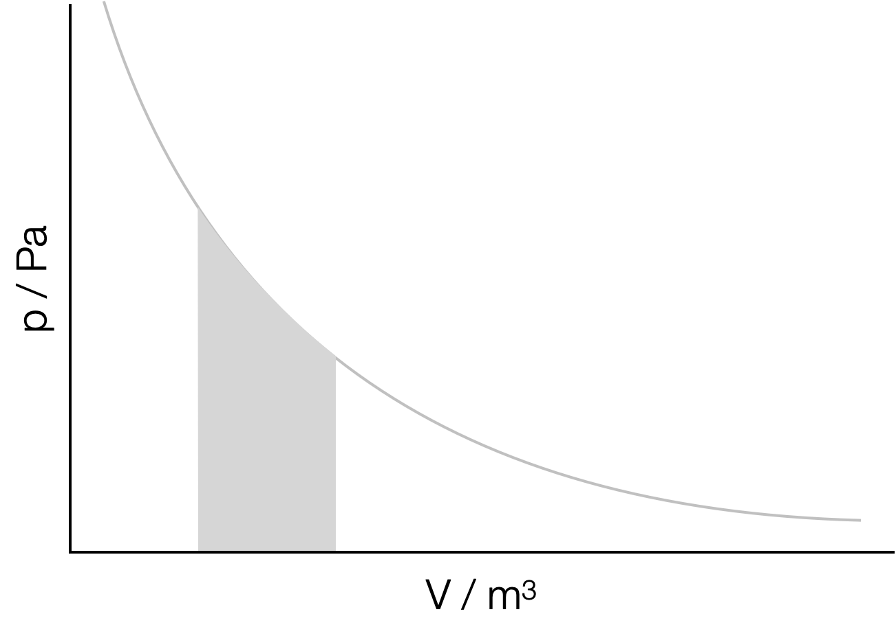
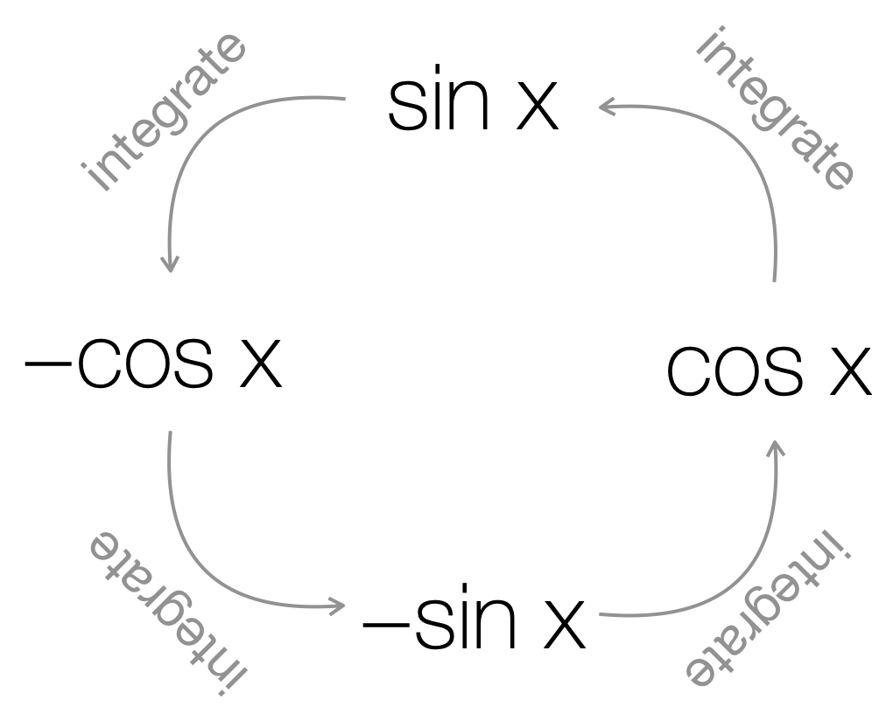

# Week 6 - Integration {#ch:Workshop6}

## Preliminary infomation {#sec:Prelim6}

When introducing rearranging of equations in Chapters \@ref(ch:Workshop1) and \@ref(ch:Workshop2) we introduce the idea of inverse functions, and every function has an inverse. With differentiation the inverse process is integration, and as such if we differentiate a function, and then integrate the answer, we should end up with our original function again. Or if we integrate a function, then differentiate the answer we should again end up with our original function.

Our integral can also be thought of as a mechanism of determining the area under a line in a plot, (or between the function and the $x$-axis). There are a number of cases whereby determining the area under a line can give us more infomation about the system. For example the area under a '$pV$' plot is work done in changing the volume ((Section)Figure \@ref(fig:integral), see CH10137 thermodynamics).

```{r echo=FALSE, integral, out.width='50%', fig.show='hold', fig.align='center', fig.cap='Integration can be used to determine the area under a line in a plot. In the case of a pressure-volume plot the area under the plot is the work done in the expansion between the initial and final volume.'}

```

If we aren't considering the area under the line between -∞ & ∞ we need to define the points on the $x$ axis of interest, these are often referred to as 'initial' and 'final'. In this case we call it a 'definite integral'. We can see an example of these in Section \@ref(subsec:definite).


Just like with integration we have a set of standard results, these are the integrals or anti-derivatives:

### Integrating polynomials {#subsec:integratingpolynomials}

If we recall Section \@ref(subsec:diffpolynomial), we saw that when we differentiated a polynomial we reduced the power by one and multiplied by the old power.

\begin{equation*}
y = ax^b\\
\frac{\textrm{d}y}{\textrm{d}x}=abx^{b-1}\\
\textrm{when } x \neq 0
\end{equation*}

To 'undo' this result we need to add one to the power and divide by the new power.

\begin{equation*}
\frac{\textrm{d}y}{\textrm{d}x}=abx^{b-1}\\
y = ax^b\\
\textrm{when } x \neq -1
\end{equation*}

However, if we had a slightly different function that we have differentiated, where $c$ is a constant:

\begin{equation*}
y = ax^b+ c\\
\frac{\textrm{d}y}{\textrm{d}x}=abx^{b-1}\\
\textrm{when } x \neq 0
\end{equation*}

but when we 'undo' this we have nothing to tell us that there used to be a constant there and so whenever we determine integrals (or anti-derivatives) we have to add a constant of integration, $+C$. So, to get back to our 'original function':

\begin{equation*}
\frac{\textrm{d}y}{\textrm{d}x}=abx^{b-1}\\
y = ax^b+C\\
\textrm{when } x \neq -1
\end{equation*}


Instead of just thinking about this as undoing the differential we can instead use our 'integral notation'. Integrals are represented by the sign $\int$, but we also need to know what we are integrating with respect to, and so at the end of our integration statement we use '$\textrm{d}x$' to define what we are integrating with respect to, in this case $x$.

:::dodo
\begin{equation}
\int ax^b \textrm{d}x = \frac{a}{b+1}x^{b+1}+C
\textrm{when } x \neq -1
(\#eq:intpoly)
\end{equation}

:::

You will notice the caveat 'when $x \neq -1$' integrating polynomials of any other power works, positive, negative, fractional, but if you recall when we never have a polynomial function which differentiates to have a power of $-1$. We show the integration of $x^{-1}$ in Section \@ref(subsec:integrating1x).


### Integrating exponentials {#subsec:integratingexponentials}

Again if we think about integration as an anti-derivative, we can start by looking back on the result when we differentiated exponential functions in Section \@ref(subsec:diffexp).

\begin{equation*}
y = be^{ax}\\
\frac{\textrm{d}y}{\textrm{d}x}=abe^{ax}
\end{equation*}

and so, integrating:

\begin{equation*}
\frac{\textrm{d}y}{\textrm{d}x}=abe^{ax}\\
y = be^{ax}+C
\end{equation*}

This again makes sense if we look at the Maclaurin expansion of an exponential function Section \@ref(sec:maclaurin).

:::dodo
\begin{equation}
\int ae^{bx} \textrm{d}x = \frac{a}{b}e^{bx}+C
(\#eq:intpoly)
\end{equation}

:::

### Integrating 1/x {#subsec:integrating1x}

In Section \@ref(subsec:integratingpolynomials) we saw that we could integrate functions of x raised to any numerical power other than $x^{-1}$. This is because no polynomial differentiates to give a result of $\tfrac{1}{x}$.

However, if we recall Section \@ref(subsec:difflogs), we saw that the differential of $\ln ax$ with respect to $x$ is $\tfrac{1}{x}$. Applying the reciprical approach of differentiation being the reverse function of integration, then:

:::dodo
\begin{equation}
\int \frac{1}{x} \textrm{d}x = \ln x + C
(\#eq:intln)
\end{equation}

:::

because of our rules of logs we can express this in a slightly different way $\int \frac{1}{x} \textrm{d}x = \ln ax$ where $\ln a = C$.

A lot of functions in chemistry end up with us needing to integrate $\tfrac{1}{x}$, you will see some of these in your thermodynamics course, and again in kinetics.

### Intergrating trig functions {#subsec:}

Again if we recall Section \@ref(subsec:difftrig) we saw the pattern for differentiating trig functions, and as our approach has been before we can approach integration as 'undoing' any differentiation we have done. So we can produce a 'reverse cycle' for integration of the trig functions $\sin$ and $\cos$, Figure \@ref(fig:trigint).

```{r echo=FALSE, trigint, out.width='60%', fig.show='hold', fig.align='center', fig.cap='The cycle of differentiation which links sin (x) and cos (x). sin (x) differentiates to cos (x), cos (x) differentiates to -sin (x), -sin (x) differentiates to -cos (x) and -cos (x) differentiates to sin x.'}

```

Formalising this (don't forget the constant of integration!):

:::dodo
\begin{equation}
\int \sin ax \textrm{d}x = -\frac{1}{a} \cos ax + C
(\#eq:intsin)
\end{equation}


\begin{equation}
\int \cos ax \textrm{d}x = \frac{1}{a} \sin ax + C
(\#eq:intsin)
\end{equation}

:::

### Differential equations {#subsec:diffequations}

In chemistry many examples of fuctions exist as differential equations, or equations that exist in a form that looks like $\tfrac{\textrm{d}y}{\textrm{d}x}=$ something. Usually to solve these we can just determine the 'anti-derivative', then solve for our constant of integration.


###  Definite Integration {#subsec:definite}

Many of the equations we use in chemistry are derived from solving differential equations, where we have a relationship for the 'rate of change' of something. If we use integration in chemistry we usually have some limits on when things make chemical sense, for example there is no chemical sense in things happening before a reaction begins, or at temperatures below absolute zero. 

To do this we can use 'limits' on our integrals, by only integrating (or determining the area) between an upper and lower limit (like in Figure \@ref(fig:integral)) we can ensure that the answer always makes chemical sense.

For example in Figure \@ref(fig:integral), the work done by an expanding gas is given by the area underneath the pressure-volume curve between the initial ($V_i$) and final ($V_f$) volumes. This is $\int p \textrm{d}V$. The relationship between pressure and volume is described by $p=\tfrac{nRT}{V}$ (the ideal gas law).

To determine the definite integral we can integrate as normal and then substitute in the values of volume at the final and initial values. The notation used in definite integrals has the limits of this integration given at the upper and lower bounds of the integral sign.

\begin{equation*}
w= - \int_{V_i}^{V_f} p \textrm{d}V = - \int_{V_i}^{V_f} \frac{nRT}{V} \textrm{d}V = -nRT \int_{V_i}^{V_f} \frac{1}{V} \textrm{d}V
\end{equation*}

We can integrate this as we have previously in Section \@ref(subsec:integrating1x):

\begin{equation*}
w = -[nRT \ln V + C]_{V_i}^{V_f}
\end{equation*}

The notation of the limits is still in place (as super- and sub- scripts on the square brackets), these values may now be substituted in tern into the above equation, following the same rules as we do in chemistry 'final - inital' (or more formally top limit minus bottom limit).

\begin{equation*}
w = (-nRT \ln V_f + C) - (-nRT \ln V_i + C)
\end{equation*}

We can now tidy this up, and we notice that the constant of integration dissapears (for one of the terms it will always be postive and for the other always negative).

\begin{equation*}
w = -nRT (\ln V_f - \ln V_i)
\end{equation*}

and then using one of our 'rules of logs' from Section \@ref(sec:rulelog)

\begin{equation*}
w = -nRT \frac{\ln V_f}{\ln V_i}
\end{equation*}

:::thing
When using differentiation we integrate as normal, but we do not need a constant of integration.

After we have integrated we substitute in the limits, with the value of the upper limit substituted in minus the value of the lower limit substituted in.

It may be that we have the define limits ourselves, such as 'final & initial' or 'value at time = 0 & value at time = t'.
:::


## Summary of concepts learnt
 
:::info
\begin{equation*}
\begin{array}{cccc}
f^{\prime}(x) \equiv y & & f(x) \equiv \int y ~\textrm{d}x & \textrm{Conditions}\\
  \hline
  \hline
A & & x + C \\ 
Ax^n & & \dfrac{A}{n+1}x^{n+1}+ C & x \neq -1\\ 
\dfrac{A}{x} \equiv A x^{-1} & &  A \ln x + C\\  
\dfrac{A}{Bx+ d} & & \dfrac{A}{B} \ln(Bx + d) +C\\ 
e^{Ax} & &\frac{1}{A} e^{Ax} + C\\
A^x && \frac{A^x}{\ln A} +C\\
A \ln x & & A \left( x \ln x - x \right)+ C\\

\sin Ax & &-\frac{1}{A}\cos Ax + C\\ 
\cos Ax & &\frac{1}{A}\sin Ax + C\\
\tan Ax & &-\frac{1}{A}\ln(\cos Ax) + C \equiv \frac{1}{A}\ln(\sec Ax) + C & -\frac{\pi}{2} < x < \frac{\pi}{2}\\

\frac{A}{x^2 + B^2} && \frac{A}{B}\tan^{-1}\left(\frac{x}{B}\right) + C &B>0\\
Ax^2 e^{Bx} && A\left(\frac{x^2}{B} - \frac{2x}{B^2} + \frac{2}{B^3} \right)e^{Bx} +C\\

v(x) \frac{\textrm{d}u(x)}{\textrm{d}x} && u(x)v(x) - \int u(x)\frac{\textrm{d}v(x)}{\textrm{d}x} +C & \textrm{Integration by Parts}\\

Au + Bv & &A\dfrac{\textrm{d}u}{\textrm{d}x} + B\dfrac{\textrm{d}v}{\textrm{d}x} \\
\end{array}
\end{equation*}
:::

## Examples

### Integrated equation for second order kinetics

:::question
Second order uni-molecular reactions are those that follow the differential rate equation:

\begin{equation*}
\frac{\textrm{d}[A]}{\textrm{d}t} = - k [A]^2
\end{equation*}


where $k$ is the rate constant for the reaction and $[A]$ the concentration of the reagent A.

Determine an integrated form of the rate equation, and sketch a graph suitable to determine the rate constant, $k$.
:::

In this case we need to start by gathering all of the $[A]$s on one side (including the $\textrm{d}[A]$) and all of the $t$s on the other, including the $\textrm{d}t$.

\begin{equation*}
\frac{1}{[A]^2} \textrm{d}[A]= - k \textrm{d}t
\end{equation*}

*This step is a little spurious in pure mathematical terms but gets us to where we need to be, and is fixed just below.*

\begin{equation*}
\int \frac{1}{[A]^2} \textrm{d}[A]= \int - k \textrm{d}t
\end{equation*}

If values are constants we can remove those from the integral.

\begin{equation*}
\int \frac{1}{[A]^2} \textrm{d}[A]=  - k \int \textrm{d}t
\end{equation*}

Now we need to *define* our limits for this definite integral:

- when $t = 0$, $[A] = [A]_0$ (this is the lower limit)
- when $t = t$, $[A] = [A]$ (this is the upper limit)

:::thing
It is 'normal' in chemistry (although often confusing), for our variable in integration and our limit to have the same symbol, in this case $t$ & $t$ and $[A]$ & $[A]$, if it makes it easier for you to think of it rename the variables in the integration.
:::

and apply them to our integral:

\begin{equation*}
\int _{[A]_0} ^{[A]} \frac{1}{[A]^2} \textrm{d}[A]=  - k \int _0 ^t \textrm{d}t
\end{equation*}

Now everything is in place for us to determine our integrals (we need to do both of them).

Starting with the '$\textrm{d}t$' integral.

\begin{equation*}
- k \int _0 ^t \textrm{d}t
\end{equation*}

\begin{equation*}
[-kt]_0^t
\end{equation*}

The notation with the limits in the square brackets says: "subsitute in each in turn, then take the bottom term away from the top", so:

\begin{equation*}
-kt - (-k*0)\\
\end{equation*}

\begin{equation*}
-kt
\end{equation*}

Now if move onto the '$\textrm{d}[A]$' integral:

\begin{equation*}
\int_{[A]_0}^{[A]} \frac{1}{[A]^2} \textrm{d}[A]\\
\end{equation*}

\begin{equation*}
\int_{[A]_0}^{[A]} [A]^{-2}\textrm{d}[A]\\
\end{equation*}

\begin{equation*}
\left[-[A]^{-1} \right] _{[A]_0}^{[A]}\\
\end{equation*}

\begin{equation*}
\left[-\frac{1}{[A]} \right] _{[A]_0}^{[A]}\\
\end{equation*}

and substituting in the values:

\begin{equation*}
\left(-\frac{1}{[A]}--\frac{1}{[A]_0} \right)\\
\end{equation*}

\begin{equation*}
\left(-\frac{1}{[A]}+\frac{1}{[A]_0} \right)\\
\end{equation*}

Combining everything together:

\begin{equation*}
\left(-\frac{1}{[A]}+\frac{1}{[A]_0} \right) = -kt
\end{equation*}

And rearranging to the form $y = mx + c$:


\begin{equation*}
\frac{1}{[A]}=\frac{1}{[A]_0} + kt
\end{equation*}

:::thing
An alternate way of doing this is to integrate without the limits and 'solve' for the constant of integration using the limits "when $t = 0$, $[A] = [A]_0$".
:::


## Questions {#sec:Questions6}

### Basic integration practice

Integrate the following with respect to the variable specified:

1. $f'(x) = \frac{a}{x}$; x
1. $f'(x) = x^\frac{3}{2}+ \frac{x^\frac{1}{2}}{2} - 2x^{-\frac{1}{2}}$, x
1. $f'(b) = \sin (ab)$; b
1. $f'(T) = a + bT + \frac{c}{T}$; T
1. $f'(t) = k$; t
1. $f'([A]) = \frac{1}{[A]}$, [A]
1. $f'([A]) = \frac{1}{[A]^2}$, [A]
1. $f'(t) = -e^{-kt}$, t

### Differential equations

Solve the following differential equations as far as possible:

1. $\frac{\textrm{d}\ln a}{\textrm{d}z}= bz^2$
1. $\frac{\textrm{d}[A]}{\textrm{d}t} = -k[A]^2$, when t= 0, [A] = [A]~0~
1. $\frac{\textrm{d}p}{\textrm{d}T}=\frac{p\Delta_{\textrm{vap}}H}{RT^2}$; when T = T~1~, p = p~1~ and when when T = T~2~, p = p~2~
1. $\frac{\textrm{d}w}{\textrm{d}V}= -\frac{nRT}{V}$, when V = V~i~, w = 0 and when V = V~f~, w = w

## Answers {#sec:Answers6}

### Basic integration practice

1. $f (x) = a \ln x + C$
1. $f(x) = \frac{2}{5} x^{\frac{5}{2}}+ \frac{x^{\frac{3}{2}}}{3}-4x^{\frac{1}{2}}+C$
1. $f(b) =-\frac{1}{a}\cos (ab) + C$
1. $f(T) = aT + \frac{bT^2}{2} + c\ln T + C$
1. $f(t) = kt +C$
1. $f([A])= \ln [A] + C$
1. $f([A])=-\frac{1}{[A]}+ C$ 
1. $f(t) = \frac{e^{-kt}}{k}$

### Differential equations

1. $\ln a = \frac{bz^3}{3}+D$
1. $\frac{1}{[A]}=\frac{1}{[A]_0}+ kt$
1. $\ln \frac{p_1}{p_2}=\frac{\Delta_{\textrm{vap}}H}{R}\left({\frac{1}{T_2}-\frac{1}{T_1}}\right)$ [Worked solution](https://youtu.be/Eo-lCuGcoP8) [Handwritten solutions](http://workitoutwithapencil.xyz/wp-content/uploads/2021/12/Q6.4.2.3.pdf)
1. $w = -nRT \ln \frac{V_f}{V_i}$
