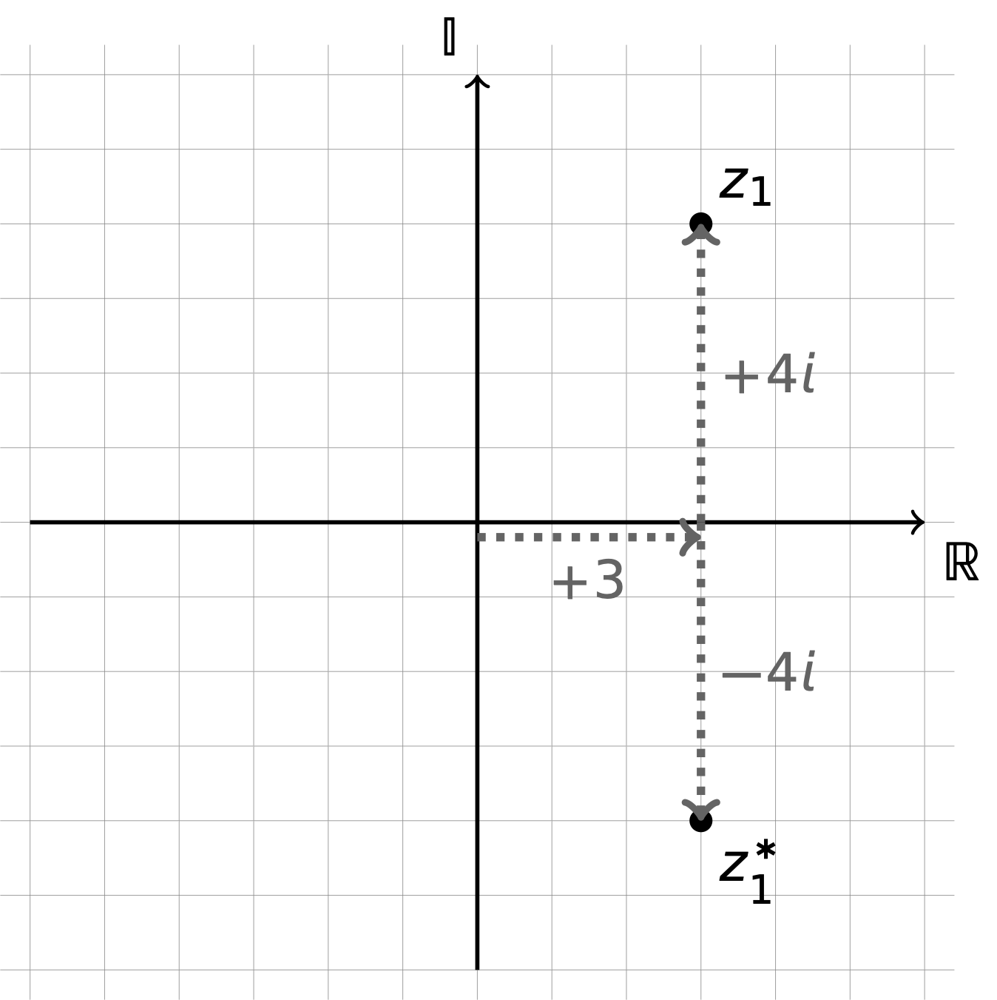
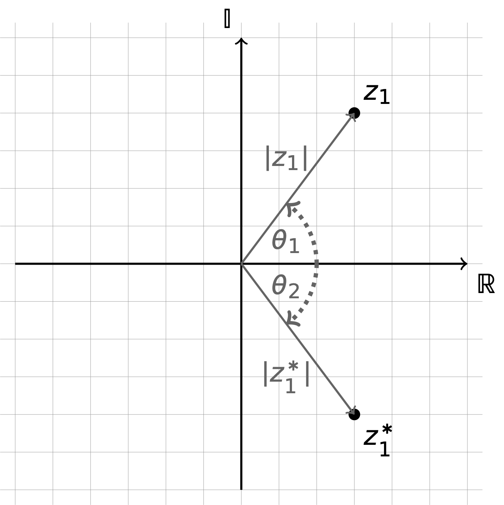

# Week 7 - Complex & Imaginary Numbers {#ch:Workshop7}

## Preliminary infomation {#sec:Prelim7}

Occassionally in chemistry we want a simple way to report a value which has two (orthogonal) components. Whilst there are many ways of doing this *complex* numbers are normally used as they are the simplest way of handling two orthogonal values^[Orthogonal is a fancy mathematical way of saying two values are always at right angles to each other, such as the axes on a graph, movement along one of these axes is independent of the other axis].

A complex number ($\mathbb{C}$) (normally represented by a $z$) is made up of a *real* ($\mathbb{R}$) and an *imaginary* component ($\mathbb{I}$).

All of the examples used here are 'pure maths' rather than applied chemistry because you will not need to use complex numbers in chemistry until second year when you do dynamic electrochemistry and quantum mechanics.


### Imaginary numbers

An imaginary number is every bit as valid as the 'real' numbers we have previously come to know and love, and their mathematics works in much the same way. To denote an imaginary number we use the symbol $i$. 2$i$ is twice as big as $i$ the same way that 2 is twice as big as 1.

Our definition of $i$ comes from our inability to find the square root of a negative number using only 'real' numbers:

:::dodo
\begin{equation}
\pm i = \sqrt{-1}
(\#eq:imaginary)
\end{equation}
:::

so this follows that $i^2 = -1$ and $i^4 = 1$.

### Complex numbers {#subsec:complex}

Complex numbers are what we get when we have a real and an imaginary component of a value. For example $1 + i$. We can work with complex numbers by treating the real and imaginary components as being independent (orthogonal) and so they just add or subtract onto their own terms.

Complex numbers are usually represented by the letter $z$, and their real component by $a$ and imaginary component $b$, such that

:::dodo
Complex numbers are given the form:

\begin{equation}
z=a+bi
(\#eq:complex)
\end{equation}
:::

:::info
If we want to add the complex number $2 + 3i$ to the real number $-7$, then we can 'add' the real terms and 'add' the imaginary terms to get our result, $-5+3i$.

---

If we want to add the complex number $2 + 3i$ to the imaginary number $-2i$, then we can 'add' the real terms and 'add' the imaginary terms to get our result, $2+i$.

---

If we want to add the complex number $2 + 3i$ to the complex number $-1+i$, then we can 'add' the real terms and 'add' the imaginary terms to get our result, $1+4i$.

---

If we multiply a complex number $2 + 3i$ by a real number $3$, we then just multiply the real and imaginary term in tern, and our result is $6+ 9i$.

***

If we multiply a complex number $2 + 3i$ by a imaginary number $3i$, we then just multiply the real and imaginary term in tern, and our result is $6i-9$.

***

If we multiply a complex number $2 + 3i$ by a complex number $2+3i$ then we can treat them as two brackets, and multiply out as we would otherwise: 

$4 + 6 i  + 6i + 9i^2$ = $4 + 6 i  + 6i - 9$ = $-5+ 12i$
:::

We can now look back on quadratic equations which didn't appear to have roots (because they don't cross the $x$-axis) and realise that they actually have complex roots.

### Complex conjugates

When dividing values by complex numbers we can use a *complex conjugate* to simplify the process.

So, for example, if we were asked to simplify:

$z = \frac{1}{2+3i}$

We could use the complex conjugate of the complex number in the demoninator of this fraction (and any division can be represented as a fraction).

The complex conjugate is when you use the same values but change the summation term between the real and imaginary parts to the opposite sign. The complex conjugate of the complex number $z$ is given the symbol $z*$.

So the complex conjugate of $2+3i$ is $2-3i$.

We can now 'muliply top and bottom' by the complex conjugate (which is just like multiplying by 1).

$z = \frac{1}{2+3i}\times \frac{2-3i}{2-3i}$

Now when we multiply out the bottom term any remaining imaginary terms disappear!

$z = \frac{2-3i}{4-6i+6i+9} = \frac{2-3i}{13}$

### Argand diagrams

Argand diagrams are graphical representations of complex numbers using the idea that axes on a graph are orthogonal and so this is a natural way to express complex numbers.

The horizontal (noramally $x$-axis) is called the 'real' axis, and the vertical (normally $y$-axis) is called the 'imaginary' axis. From this we can express any complex number.

```{r echo=FALSE, argand, out.width='50%', fig.show='hold', fig.align='center', fig.cap='An Argand diagram may be used to represent complex numbers, in this case 3+4i and 3-4i. The real axis is the x-axis and the imaginary axis is the y-axis, and we can think of the complex number as representing coordinates along these axes.'}

```


### Euler's representation 

Visualising a complex number on an Argand diagram (figure \@ref(fig:argand)) gives us an alternative method of representing complex numbers, as we may use the distance from the origin (or modulus, $|z|$) and angle from the real axis ($\theta$).

The angle is determined as a clockwise rotation from the positive real axis.

```{r echo=FALSE, argandangle, out.width='50%', fig.show='hold', fig.align='center', fig.cap='The graphical representation of an Argand diagram allows us another way of representing a complex number, as the modulus and angle from the real axis (in a counter-clockwise direction) of the line from the origin to the complex number.'}

```
 
Pythagoras' theorem may be used to determine the modulus, and the angle determined from triganometry.

However this means we can express both the real ($\mathbb{R}$) and imaginary ($\mathbb{I}$) components in relation to this modulus and angle.

For the complex number $a+bi$, then:

\begin{equation*}
|z| = \sqrt{a^2+b^2}
\end{equation*}

and the angle, $\theta$, may be represented as either the $\sin$ or $\cos$ (we could use $\tan$, but we don't... why makes more sense when you read on)...

:::dont
Whenever determining angles here we should be using radians not degrees.
:::

\begin{equation*}
\theta =  \sin^{-1} \left(\frac{b}{|z|}\right)
\end{equation*}

or 

\begin{equation*}
\theta =  \cos^{-1} \left(\frac{a}{|z|}\right)
\end{equation*}

This means that we can express $a$ and $b$ in terms of the modulus $|z|$ and angle $\theta$.

\begin{equation*}
a = |z| \cos \theta
\end{equation*}

and

\begin{equation*}
a = |z| \cos \theta
\end{equation*}

and so we can express our complex number $z$ as:

\begin{equation}
z = a+bi = |z| (\cos \theta + i \sin \theta)
(\#eq:Euler)
\end{equation}

You can use Macclaurian expansion (section \@ref(sec:maclaurin)) to show that $e^{i\theta} = \cos \theta + i \sin \theta$. However all we care about is the result.

:::dodo
Euler's representation of a complex number links trigonometric terms and Euler's number $e$.

\begin{equation}
z=|z| (\cos \theta + i \sin \theta)
(\#eq:complextrig)
\end{equation}

\begin{equation}
z = |z| e^{i\theta}
(\#eq:complexeuler)
\end{equation}
:::

### DeMoivre's theorem

DeMoivre's theorem is used to simply determine the value of a complex number raised to a power. For example, if we consider $(2+ i)^8$, then we could attempt to multiply out the bracket, but this is a time consuming and sometimes error inducing process. However if we use the Euler representation of a complex number then raising the complex number to a power becomes much more simple.

DeMoivre's theorem states:

:::dodo
\begin{equation}
z^n = |z|^n e^{in\theta}
(\#eq:demoivre)
\end{equation}
:::

So for our example of $(2+ i)^9$:

First we need to determine the modulus ($\sqrt{1^2+2^2}$), then the angle to the positive real axis ($\theta =  \sin^{-1} \left(\frac{1}{\sqrt{5}}\right) \simeq 0.464$).

Using DeMoivre's theorem:

$(2+ i)^8 = |\sqrt{5}|^8e^{8i\times 0.464}$

$(2+ i)^8 = 5^4e^{3.709i}$

Now we can convert it back into 'standard' complex number notation:

\begin{equation*}
z = a+bi = 625 (\cos 3.709 + i \sin 3.709)
\end{equation*}

\begin{equation*}
z = a+bi = 625 (-\frac{527}{625} - \frac{336}{625}i)
\end{equation*}

\begin{equation*}
z = -527-336i
\end{equation*}

We can 'check' this by multiplying out our brackets!

## Summary of key concepts {#sec:Summary7}

:::info

You can use the 'complex' mode on your calculator to return values with i in.

An imaginary number is given to us by:
\begin{equation*}
\pm i = \sqrt{-1}
\end{equation*}

Complex numbers are represented by 'standard' or Euler notation:

\begin{equation*}
z=a+bi=|z| (\cos \theta + i \sin \theta)
\end{equation*}

We can use DeMoivre's theorem to determine complex numbers raised to particular powers:

\begin{equation*}
z^n = |z|^n e^{in\theta}
\end{equation*}

:::

## Questions {#sec:questions7}

### Complex number calculations

$a=1+2i$, $b=3-4i$, $c=7i$, $d = -3+6i$ $e = -1-i$

Determine the results of each of the following complex number calculations:

- $a+b$
- $a+ c$
- $d-e$
- $c-b$
- $a \times e$
- $b \times d$
- $c \times a$
- $b \times c$
- $\frac{a}{b}$
- $\frac{b}{c}$
- $\frac{c}{d}$
- $\frac{d}{e}$


### Determining exponential form

- $z = 1-3i$
- $z = 3+4i$
- $z = -1-1i$
- $z = -1+4i$
- $z = -4+3i$

### Complex number calculations of powers

- $z = (-4+9i)^{9}$
- $z = (-9+9i)^{23}$
- $z = (2-6i)^{13}$
- $z = (4+i)^{5}$
- $z = (8+7i)^{-3}$
- $z = (3+8i)^{-7}$
- $z = (8-8i)^{-2}$
- $z = (-6-2i)^{-7}$
- $z = (-7-4i)^{0}$
- $z = (-7-6i)^{-5}$


## Answers {#sec:answers7}


### Complex number calculations

- $4-2i$
- $1+9i$
- $-2+7i$
- $-3+11i$
- $1-3i$
- $15 + 30i$
- $-14+7i$
- $28+21i$
- $\frac{-5+10i}{25}$
- $\frac{-4-3i}{7}$
- $\frac{42-21i}{45}$
- $\frac{-3-9i}{2}$

### Determining exponential form

- $z = 3.16e^{-1.25i}$
- $z = 5e^{0.93i}$
- $z = 1.41e^{0.79i}$
- $z = 4.12e^{-1.33i}$
- $z = 5e^{-0.64i}$

### Complex number calculations of powers

- $z = (9.85e^{-1.15i})^9 \equiv(8.72E+08)e^{-10.35i}$
- $z = (12.73e^{-0.79i})^23 \equiv(2.57E+25)e^{-18.17i}$
- $z = (6.32e^{-1.25i})^13 \equiv(2.59E+10)e^{-16.25i}$
- $z = (4.12e^{0.24i})^5 \equiv(1.19E+03)e^{1.2i}$
- $z = (10.63e^{0.72i})^-3 \equiv(8.32E-04)e^{-2.16i}$
- $z = (8.54e^{1.21i})^-7 \equiv(3.01E-07)e^{-8.47i}$
- $z = (11.31e^{-0.79i})^-2 \equiv(7.81E-03)e^{1.58i}$
- $z = (6.32e^{0.32i})^-7 \equiv(2.47E-06)e^{-2.24i}$
- $z = 1$
- $z = (9.22e^{0.71i})^-5 \equiv(1.50E-05)e^{-3.55i}$


